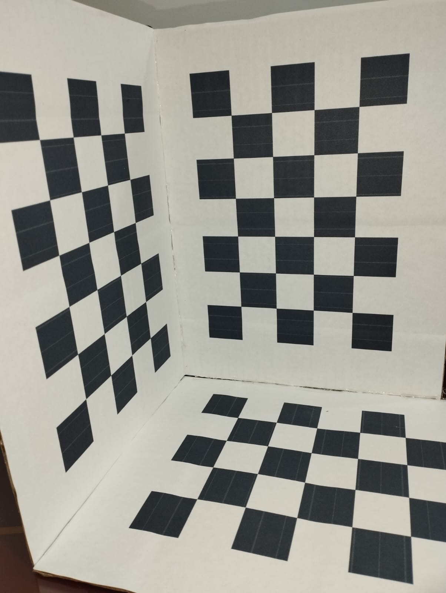
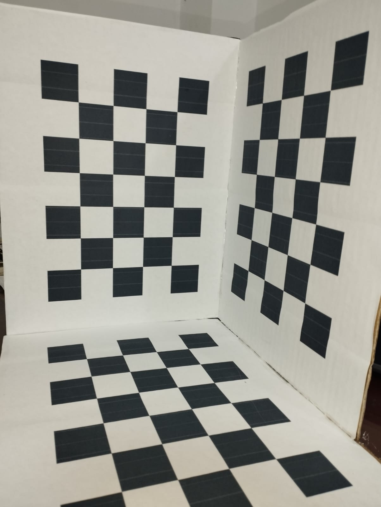

# Tsai-Python

# Calibración de Cámara 

## Descripción
Este proyecto aborda la calibración de una cámara utilizando el método de Tsai, seguido de la corrección de distorsión radial con OpenCV, y finaliza con el desarrollo de una aplicación de demostración para validar la calibración.

## Proceso de Calibración

### Calibración con el Método de Tsai

1. **Preparación del Aparato de Tsai**:
   Configuración del patrón de calibración.

2. **Captura de Imágenes**:
   Las imágenes  que se muestran a continuación, presentan los ejemplos en la captura de las imágenes antes de la calibración de la cámara.

  
  
  

   Imágenes capturadas desde diferentes ángulos.

## Proceso de Etiquetado de Imágenes con Patrón de Ajedrez

El proceso de etiquetado de las imágenes que contienen el patrón de ajedrez es un paso crucial para la calibración precisa de la cámara. A continuación se detallan los pasos seguidos:

1. **Selección de Imágenes**:
   - Estas imágenes contienen el patrón de ajedrez visible desde diferentes ángulos como se evidencia previamente.

2. **Identificación de Esquinas**:

   - Para el procesamiento de imágenes en este proyecto, la necesidad de software avanzado como OpenCV es fundamental para identificar automáticamente las esquinas del patrón de ajedrez en cada imagen.

Se observan algunas imágenes a continuación:

  
  
  

Imagenes etiquetadas

### Funciones Principales del Proyecto

1. **`load_image(file_path)`**:
   - Carga una imagen en escala de grises desde la ruta de archivo especificada.
   - Utiliza `cv2.imread` con el flag `cv2.IMREAD_GRAYSCALE`.

2. **`get_corner_points(image)`**:
   - Obtiene los puntos de esquina de una imagen utilizando `cv2.goodFeaturesToTrack`.
   - Retorna los puntos de esquina como un array de NumPy.

3. **`show_corners(image, corners)`**:
   - Visualiza los puntos de esquina en una imagen.
   - Marca cada punto de esquina con `cv2.circle` y `cv2.putText`.

4. **`corners_report(corners)`**:
   - Imprime un reporte de los puntos de esquina encontrados.
   - Muestra el número de esquinas y sus coordenadas x, y.

3. **Verificación Manual**:
   - La verificación manual asegura que todas las esquinas hayan sido identificadas correctamente.
   - Además corrige cualquier error en la detección automática para garantizar la precisión en el proceso de calibración.

4. **Almacenamiento de Coordenadas**:
   - Es importante mantener una estructura de datos consistente para facilitar el procesamiento posterior.

5. **Repetición para Todas las Imágenes**:
   - Este proceso se repite para todas las imágenes seleccionadas en la carpeta `shoots`.

Este proceso asegura que se tenga la información necesaria sobre la posición de las esquinas del patrón en cada imagen. 

### Desarrollo de una Aplicación de Demostración

1. **Selección de una Aplicación**:
   Aplicación que queremos.... No lo sé Diosito
2. **Parámetros de calibración**:
   Mostrar las matrices.

3. **Implementación del proyecto**:

    Subir imágenes de demos... DIooos

